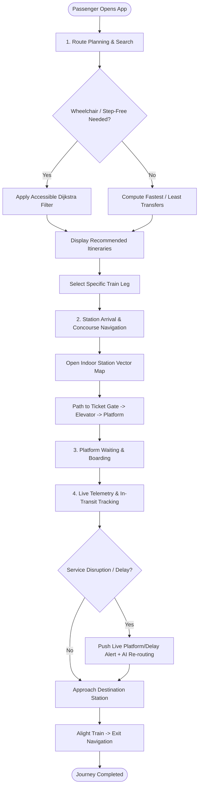
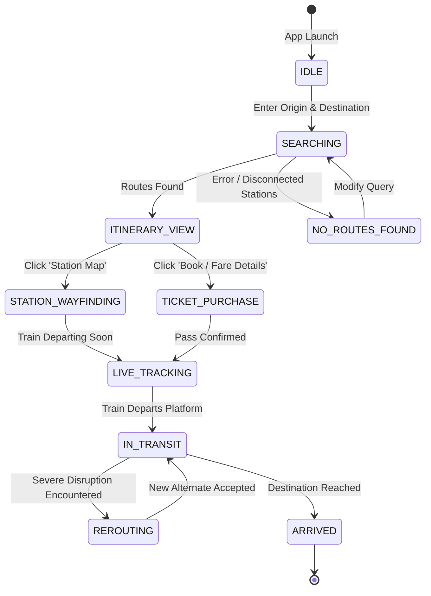

# Passenger User Flows & Interaction Workflows - SmartRail-Navigator

This document details the critical user journeys, state transitions, and step-by-step decision trees for passengers using SmartRail-Navigator.

---

## 1. High-Level Passenger Experience Flow

---

## 2. Step-by-Step User Journey Scenarios

### Scenario A: Rush-Hour Commuter
1. **Search**: Opens application $\rightarrow$ System auto-detects nearest station ("Central Grand Terminal").
2. **Preference**: Commuter selects "Least Transfers" preference.
3. **Selection**: Picks the 08:15 AM Gold Express service.
4. **Live Alert**: At 08:10 AM, WebSocket alert sounds: "Train 101 reassigned to Platform 4B due to switch congestion on Track 2".
5. **Action**: Commuter looks at the animated station indicator pointing directly to the stairs/escalator to Platform 4B.

### Scenario B: Wheelchair Passenger Navigation
1. **Search**: Selects origin "Central Grand Terminal" and destination "River Junction".
2. **Filter**: Toggles on **"Step-Free Accessibility (Wheelchair/Stroller)"**.
3. **Itinerary**: Routing eliminates all paths with footbridges or stairwells; guarantees level boarding or conductor ramp assistance.
4. **Indoor Map**: Displays a highlighted green accessible path guiding from Entrance A $\rightarrow$ Wide Ticket Gate $\rightarrow$ Concourse Elevator EL-2 (Level -2) $\rightarrow$ Platform 4 Wheelchair Boarding Zone.
5. **AI Companion**: Passenger queries "Where is the nearest accessible restroom at River Junction?" AI Copilot responds with immediate location: "Ground Level Concourse, opposite Baggage Claim 1, equipped with automatic power door."

---

## 3. Passenger State Machine

